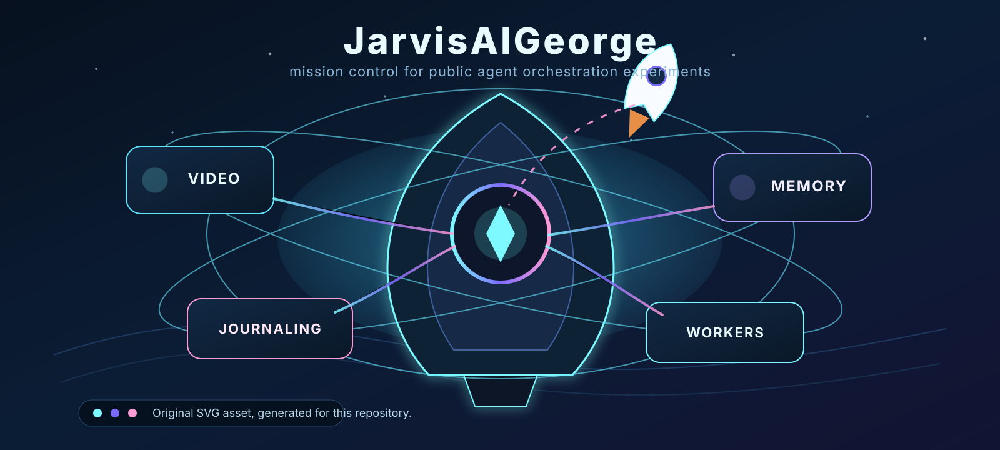

<h1 align="center">JarvisAIGeorge</h1>

  
  
  

<h3 align="center">A public MIT-licensed fork of FirstMate for Herdr-first agent orchestration experiments.</h3>

  

## What it is

JarvisAIGeorge is George Wang's public fork of [FirstMate](https://github.com/kunchenguid/firstmate).
It inherits FirstMate's Git history, MIT license, upstream authorship, and core idea of talking to one supervising agent while worker agents handle scoped tasks.
This repository is the public engine layer only.
Private controller policy, personal paths, credentials, journals, and user-specific overlays do not ship in this public repository.

JarvisAIGeorge is currently a rebranded fork with a small public adaptation layer.
The current implemented behavioral difference is that shared-checkout operation is the default for this fork, while Git worktrees remain an explicit opt-in rather than the assumed path.
Most inherited FirstMate behavior is still present unless a later JarvisAIGeorge change says otherwise and carries validation.

## Current focus

- **Public engine boundary.** Keep reusable agent-orchestration code and documentation public while user-specific adoption stays in private overlays or local configuration.
- **Shared-checkout default.** Favor the repository's canonical checkout unless an operator deliberately opts into worktree isolation.
- **Herdr-first direction.** Treat Herdr as the preferred visible-worker direction, while documenting other runtimes only according to the behavior actually inherited or implemented.
- **Workers before managers.** Use ordinary workers for scoped execution first, and introduce durable manager roles only after recurring coordination need is proven.

See [`docs/jarvisharness.md`](docs/jarvisharness.md) for the fork baseline and adaptation contract.
The historical FirstMate architecture remains available in [`docs/architecture.md`](docs/architecture.md) where it has not yet been adapted.

## Planned roadmap

The items below are planned direction, not shipped specialist systems.

- **Configurable specialist Agent Packs.** Package optional domain modules that an operator can enable, such as video editing, memory, research, or project-specific review workflows.
- **Optional journaling and logging workflows.** Add user-controlled workflows for daily notes, execution logs, or operating memory without committing private journal content to the public repository.
- **Private user overlays.** Support local or private-repository adoption layers that can define names, preferences, workflows, and credentials without leaking personal data into the public engine.
- **Clear runtime terminology.** Move public docs toward workers, managers, and runtime adapters where that language is backed by implemented behavior.

## Relationship to FirstMate

FirstMate remains the upstream project: <https://github.com/kunchenguid/firstmate>.
JarvisAIGeorge is a fork, so the repository history and license attribution intentionally preserve FirstMate provenance.
Future upstream sync should be review-driven and commit-pinned rather than an automatic merge of upstream `main`.

## Requirements

JarvisAIGeorge currently inherits FirstMate's tool requirements unless an adaptation note says otherwise.
At minimum, expect a supported coding-agent runtime, Git, GitHub CLI authentication for GitHub-backed project work, and the selected worker-session backend.
Backend-specific setup belongs in the linked documentation below.

## Documentation

- [`docs/jarvisharness.md`](docs/jarvisharness.md) - public fork baseline, boundary, and adaptation plan.
- [`docs/architecture.md`](docs/architecture.md) - inherited FirstMate architecture that still describes much of the current codebase.
- [`docs/configuration.md`](docs/configuration.md) - current configuration surfaces inherited from FirstMate.
- [`docs/tmux-backend.md`](docs/tmux-backend.md) - tmux backend setup and limits.
- [`docs/herdr-backend.md`](docs/herdr-backend.md) - Herdr backend status, limits, and verification pointers.
- [`docs/zellij-backend.md`](docs/zellij-backend.md) - experimental Zellij backend setup and limits.
- [`docs/orca-backend.md`](docs/orca-backend.md) - experimental Orca backend setup and limits.
- [`docs/cmux-backend.md`](docs/cmux-backend.md) - experimental cmux backend setup and limits.
- [`docs/remote-secondmates.md`](docs/remote-secondmates.md) - inherited remote second mate setup and safety behavior.
- [`docs/wedge-alarm.md`](docs/wedge-alarm.md) - inherited away-mode escalation alert setup.
- [`docs/documentation-audiences.md`](docs/documentation-audiences.md) - documentation placement and audience rules.
- [`CONTRIBUTING.md`](CONTRIBUTING.md) - contribution workflow and validation rules inherited from FirstMate.

## Asset provenance

The hero image at [`assets/jarvis-ai-george-hero.svg`](assets/jarvis-ai-george-hero.svg) is an original SVG created for this repository.
It uses an abstract mission-control, rocket, and agent-orchestration motif.
It does not copy FirstMate artwork, Marvel/JARVIS character imagery, or copyrighted visual elements.

## License

MIT - see [`LICENSE`](LICENSE).
